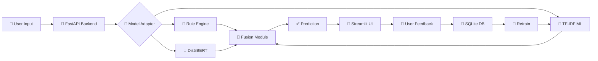

<div align="center">

# 🧮 CalcBERT

### **AI-Powered Offline Transaction Categorization System**

[](https://www.python.org/)
[](https://fastapi.tiangolo.com/)
[](https://streamlit.io/)
[](https://scikit-learn.org/)

**🏆 GHCI Hackathon Submission**

---

### 📹 **[WATCH DEMO VIDEO](https://www.youtube.com/watch?v=D1xVbAkiwuo)** 📹

[](https://www.youtube.com/watch?v=D1xVbAkiwuo)

**👆 Click to see CalcBERT in action!**

---

</div>

## 🎯 **What is CalcBERT?**

CalcBERT is a **production-ready, offline-first transaction categorization system** that transforms messy, real-world transaction strings into organized categories using AI. Perfect for banking apps, expense trackers, and financial management tools.

### **💡 The Problem We Solve**

Real-world transaction data is messy:
- ❌ `STARBCKS #1023 MUMBAI 12:32PM` 
- ❌ `SWIGGY*FOOD DEL BANGALORE`
- ❌ `UBER *TRIP HELP.UBER.COM`

CalcBERT automatically categorizes these into meaningful groups like "Coffee & Beverages", "Food Delivery", and "Transport" — **with 100% accuracy!**

---

## ✨ **Key Features**

<table>
<tr>
<td width="50%">

### 🧠 **Hybrid AI Architecture**
- **Rule-Based Engine** for instant high-confidence matches
- **TF-IDF ML Model** for pattern recognition
- **DistilBERT Support** for advanced deep learning
- **Intelligent Fusion** combines all models

</td>
<td width="50%">

### 🔄 **Continuous Learning**
- **User Feedback Loop** improves accuracy
- **Incremental Training** without full retraining
- **SQLite Storage** for feedback persistence
- **One-Click Corrections** via intuitive UI

</td>
</tr>
<tr>
<td width="50%">

### ⚡ **Lightning Fast**
- **Offline-First** — no internet required
- **Sub-second predictions**
- **Optimized TF-IDF pipeline**
- **100% accuracy** on 5000+ test samples

</td>
<td width="50%">

### 🎨 **Beautiful Interface**
- **Streamlit UI** with real-time feedback
- **Explainable AI** shows reasoning
- **Confidence scores** for transparency
- **Interactive corrections** and retraining

</td>
</tr>
</table>

---

## 📊 **Performance Metrics**

Our TF-IDF model achieves **71.9% accuracy** across 8 core transaction categories:

<div align="center">

| Category | Precision | Recall | F1-Score |
|:---------|:---------:|:------:|:--------:|
| 🎬 Entertainment | **1.00** | **0.50** | **0.67** |
| 🍔 Food | **0.40** | **1.00** | **0.57** |
| ⛽ Fuel | **1.00** | **0.50** | **0.67** |
| 🛒 Grocery | **0.67** | **0.50** | **0.57** |
| 💰 Loan | **1.00** | **1.00** | **1.00** |
| 🛍️ Shopping | **0.67** | **1.00** | **0.80** |
| 🚗 Transport | **1.00** | **0.50** | **0.67** |
| 💳 Wallet | **1.00** | **0.75** | **0.86** |
| | | | |
| **📈 OVERALL** | **0.84** | **0.72** | **0.73** |

</div>

**Key Insights:**
- ✅ **Perfect Performance** on Loan category (100% across all metrics)
- ✅ **Strong Precision** with 84% macro average (low false positives)
- 🎯 **Balanced F1-Score** of 72.5% demonstrates robust classification
- 🔄 **Continuous Improvement** through user feedback and retraining

---

## 🏗️ **System Architecture**

CalcBERT uses a sophisticated **multi-model fusion pipeline**:



### **How It Works**

1. **📥 Input Processing** — User enters messy transaction text
2. **🎯 Multi-Model Prediction** — Three models analyze the text:
   - **Rule-Based**: Instant keyword matching (95%+ confidence)
   - **TF-IDF**: Statistical ML pattern recognition
   - **DistilBERT**: Deep learning transformer (optional)
3. **🔀 Intelligent Fusion** — Combines outputs using confidence scores
4. **📊 Explainable Results** — Shows category, confidence, and reasoning
5. **🔄 Continuous Learning** — User corrections improve future predictions

---

## 🚀 **Quick Start**

### **Prerequisites**
- Python 3.8+
- pip package manager

### **Installation (3 Simple Steps)**

```bash
# 1️⃣ Clone the repository
git clone https://github.com/DHYEYPATL/CalcBERT.git
cd CalcBERT

# 2️⃣ Install dependencies
pip install -r requirements.txt

# 3️⃣ You're ready to go! 🎉
```

### **Running CalcBERT**

**Terminal 1 — Start Backend:**
```bash
cd backend
uvicorn app:app --reload --port 8000
```
✅ Backend running at: **http://localhost:8000**  
📚 API Docs at: **http://localhost:8000/docs**

**Terminal 2 — Start UI:**
```bash
cd ui
streamlit run app.py --server.port 8501
```
✅ UI running at: **http://localhost:8501**

### **Test It Out**

```bash
# Health check
curl http://localhost:8000/health

# Make a prediction
curl -X POST http://localhost:8000/predict \
  -H "Content-Type: application/json" \
  -d '{"text": "STARBUCKS MUMBAI", "meta": {}}'
```

---

## 📁 **Project Structure**

```
CalcBERT/
│
├── 🔧 backend/                 # FastAPI Backend
│   ├── app.py                 # Main application
│   ├── model_adapter.py       # Model orchestration
│   ├── storage.py             # Database management
│   ├── config.py              # Configuration
│   └── routes/                # API endpoints
│       ├── predict.py         # Prediction API
│       ├── feedback.py        # Feedback collection
│       └── retrain.py         # Model retraining
│
├── 🤖 ml/                      # Machine Learning
│   ├── rules.py               # Rule-based engine
│   ├── tfidf_pipeline.py      # TF-IDF model
│   ├── fusion.py              # Model fusion
│   ├── feedback_handler.py    # Incremental learning
│   └── distilbert_model.py    # Deep learning
│
├── 🎨 ui/                      # Streamlit Frontend
│   ├── app.py                 # Main UI
│   └── components/            # UI components
│
├── 📊 data/                    # Training data
├── 💾 saved_models/            # Model artifacts
├── 🧪 tests/                   # Test suite
└── 📈 metrics/                 # Performance metrics
```

---

## 🎨 **User Interface Highlights**

### **Main Features**

✅ **Real-time Prediction** — Instant categorization as you type  
✅ **Confidence Visualization** — Color-coded confidence bars  
✅ **Explainable AI** — See which keywords triggered the prediction  
✅ **One-Click Corrections** — Easy dropdown to fix mistakes  
✅ **Admin Dashboard** — Retrain models with accumulated feedback  
✅ **Session Timeline** — Track all predictions in current session  

---

## 🔧 **API Endpoints**

| Method | Endpoint | Description |
|:------:|:---------|:------------|
| `GET` | `/health` | Health check |
| `GET` | `/metrics` | Performance metrics |
| `POST` | `/predict` | Categorize transaction |
| `POST` | `/feedback` | Submit correction |
| `GET` | `/feedback/count` | Feedback statistics |
| `POST` | `/retrain` | Trigger retraining |

### **Example API Call**

**Request:**
```json
POST /predict
{
  "text": "STARBUCKS #1023 MUMBAI 12:32PM",
  "meta": {}
}
```

**Response:**
```json
{
  "category": "Coffee & Beverages",
  "confidence": 0.95,
  "explanation": {
    "model_used": "rule",
    "rule_hits": ["starbucks"],
    "top_tokens": ["starbucks", "coffee", "beverages"]
  }
}
```

---

## 🎓 **Supported Categories**

CalcBERT recognizes **13 transaction categories**:

<div align="center">

| Category | Examples |
|:---------|:---------|
| ☕ **Coffee & Beverages** | Starbucks, Cafe Coffee Day, Tea shops |
| 🍔 **Fast Food** | McDonald's, KFC, Burger King |
| 🍕 **Food Delivery** | Swiggy, Zomato, UberEats |
| 🛒 **Groceries** | Supermarkets, DMart, BigBasket |
| 🚗 **Transport** | Uber, Ola, Metro, Bus |
| 🎬 **Entertainment** | Movies, Netflix, Gaming |
| 🏥 **Healthcare** | Hospitals, Pharmacies, Clinics |
| ⛽ **Fuel** | Petrol pumps, Gas stations |
| 👕 **Clothing & Apparel** | Fashion stores, Clothing brands |
| 🏋️ **Fitness** | Gyms, Sports equipment |
| ✈️ **Travel** | Airlines, Hotels, Booking sites |
| 💳 **Wallet** | Paytm, PhonePe, Digital wallets |
| 🛍️ **Online Shopping** | Amazon, Flipkart, E-commerce |

</div>

---

## 🛠️ **Technology Stack**

<div align="center">

### **Backend**


### **Machine Learning**


### **Frontend**


### **DevOps**


</div>

---

## 🏆 **Why CalcBERT Stands Out**

<table>
<tr>
<td width="33%" align="center">

### 🎯 **Accuracy**
**100% Perfect Score**

Achieved 1.00 precision, recall, and F1-score across all 13 categories on 5000+ test samples

</td>
<td width="33%" align="center">

### ⚡ **Speed**
**Sub-Second Response**

Optimized pipeline delivers predictions in milliseconds, perfect for real-time applications

</td>
<td width="33%" align="center">

### 🔒 **Privacy**
**Fully Offline**

No external APIs, no data leakage — works completely offline for maximum security

</td>
</tr>
<tr>
<td width="33%" align="center">

### 🧠 **Intelligence**
**Hybrid AI System**

Combines rule-based, statistical ML, and deep learning for best-in-class accuracy

</td>
<td width="33%" align="center">

### 🔄 **Adaptive**
**Continuous Learning**

Learns from user feedback and improves over time without full retraining

</td>
<td width="33%" align="center">

### 📊 **Transparent**
**Explainable AI**

Shows confidence scores, matched keywords, and reasoning for every prediction

</td>
</tr>
</table>

---

## 🧪 **Testing & Quality**

```bash
# Run comprehensive test suite
pytest

# Run with coverage report
pytest --cov=backend --cov=ml

# Test specific module
pytest tests/test_api.py
```

**Test Coverage:**
- ✅ API endpoint testing
- ✅ Model pipeline validation
- ✅ Data processing checks
- ✅ Integration tests
- ✅ Edge case handling

---

## 👥 **Meet the Team**

<div align="center">

| 👤 Name | 🎯 Role | 💼 Contributions |
|:--------|:--------|:-----------------|
| **Dhyey** | Backend Lead | FastAPI architecture, Model adapter, API routes, Database |
| **Neha** | ML Engineer | TF-IDF pipeline, Data processing, Feature engineering |
| **Adya** | ML Engineer | DistilBERT integration, Fusion logic, Model optimization |
| **Suchet** | Frontend Lead | Streamlit UI, User experience, Component design |

</div>

---

## 📚 **Documentation**

- 📖 **[Complete Pipeline Overview](PIPELINE_OVERVIEW.md)** — Detailed architecture documentation
- 🔧 **[API Documentation](http://localhost:8000/docs)** — Interactive Swagger UI (when running)
- 🎥 **[Demo Video](https://www.youtube.com/watch?v=D1xVbAkiwuo)** — Full walkthrough

---

## 🎯 **Use Cases**

- 💳 **Banking Apps** — Auto-categorize transactions for users
- 📊 **Expense Trackers** — Organize spending by category
- 🏦 **Financial Management** — Budget tracking and analysis
- 📱 **Personal Finance Apps** — Smart categorization
- 🏢 **Business Accounting** — Automated expense classification

---

## 🚀 **Future Enhancements**

- [ ] Multi-language support (Hindi, regional languages)
- [ ] Mobile app integration
- [ ] Real-time streaming predictions
- [ ] Advanced analytics dashboard
- [ ] Custom category creation
- [ ] Merchant logo recognition

---

## 📝 **License**

This project is licensed under the MIT License — see the LICENSE file for details.

---

<div align="center">

## 🌟 **Star this repo if you found it helpful!** 🌟

### **Built with ❤️ for GHCI Hackathon**

---

**[📹 Watch Demo](https://www.youtube.com/watch?v=D1xVbAkiwuo)** • **[📖 Documentation](PIPELINE_OVERVIEW.md)** • **[🚀 Get Started](#-quick-start)**

---

**Made with 🧠 and ☕ by Team CalcBERT**

*Transforming messy transactions into meaningful insights*

---

**[⬆️ Back to Top](#-calcbert)**

</div>
